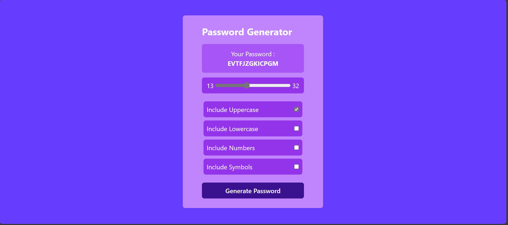

# Password Generator

This is a simple password generator web application that allows you to create strong and secure passwords. You can customize the length and character types (uppercase letters, lowercase letters, numbers, and symbols) included in your generated password.

## Features

- Generate random passwords with custom settings.
- Choose the length of your password (from 1 to 32 characters).
- Include or exclude character types such as uppercase letters, lowercase letters, numbers, and symbols.
- See your generated password in real-time.

## Usage

1. Open the `index.html` file in your web browser.

2. Set the desired password length using the range slider or input field. The default length is 1 character, and the maximum is 32 characters.

3. Check or uncheck the checkboxes to include or exclude character types (Uppercase, Lowercase, Numbers, and Symbols) in your password.

4. Click the "Generate Password" button to create a random password based on your settings.

5. Your generated password will be displayed in the "Your Password" field.
